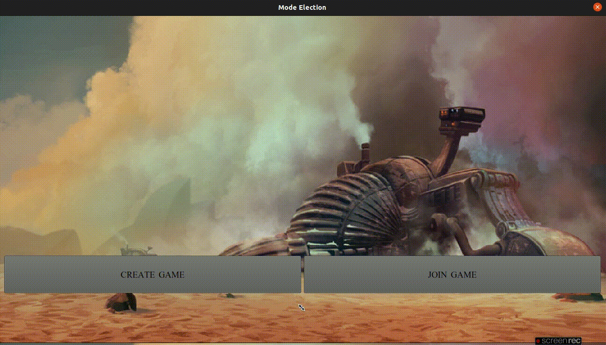
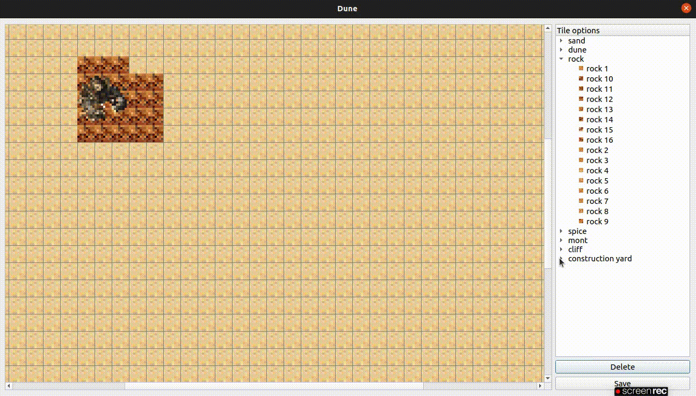

# Dune 2000
-----------------------------------------------------------------------

### Trabajo Práctico final - Taller de programación I [75.42/95.08] - FIUBA

### Grupo: 2

### Integrantes:
* Sabella Rosa, Cristóbal - csabella@fi.uba.ar - 106440
* Gaddi, María Pilar - mgaddi@fi.uba.ar - 105682
* Sardella, Florencia - fsardella@fi.uba.ar - 105717

## Introducción
-----------------------------------------------------------------------

El presente proyecto reune la documentación del tercer trabajo práctico de la materia Taller de Programación I, que consiste en recrear el juego de estrategia Dune 2000. Para ello se diseño un protocolo de comunicación cliente-servidor con distintas interfaces gráficas, además de un editor de mapas. El trabajo se desarolló en C++ utilizando los conceptos de Sockets y Threads, uso de tipo de datos abstractos, RAII e interfaz grafica con QT y SDL.

## Instalación
-----------------------------------------------------------------------

La instalación del juego se puede llevar a cabo de dos maneras: manual y automático.

En caso de que se opte por la *versión manual* se deberán instalar las siguientes dependencias:

  - make
  - build-essential
  - qt5-default https://web.stanford.edu/dept/cs_edu/resources/qt/install-linux - versiones mayores a 5.12
  - libqt5multimedia5-plugins
  - qtmultimedia5-dev
  - yaml-cpp https://github.com/jbeder/yaml-cpp
  - libsdl2-dev
  - libsdl2-image-dev
  - libsdl2-gfx-dev
  - libsdl2-ttf-dev
  - libsdl2-mixer-dev

El paso siguiente sería correr los siguientes comandos:
~~~
git clone https://github.com/fsardella/Dune_TP3
cd Dune_TP3
mkdir build
cd build
cmake PATH_A_CMAKELIST
make
~~~

En caso de que se opte por la *versión automática*, se deberá abrir la consola de comandos y ejecutar:

~~~
git clone https://github.com/fsardella/Dune_TP3
cd Dune_TP3
sh installer.sh
~~~

Nota: se deberá ejecutar el servidor previo a ejecutar al cliente.

Aclaraciones:
* El proyecto ha sido probado en distintas versiones de linux, una de ellas la 22.

## Ejecución

Luego de la instalación, se crearán los siguientes ejecutables:

- `./server ../server/config.yaml`: para ejecutar el servidor
- `./client_interface`: para ejecutar el cliente
- `./editor_interface`: para ejecutar el editor

Nota: el PORT (puerto) para que los clientes se puedan conectar al servidor se puede modificar desde el archivo config.yaml ubicado en la carpeta Dune_TP3/server/config.yaml. El PORT que se encuentra en el archivo actualmente es el 8080.

## Modo de uso

En principio, se debe ejecutar el servidor.

Una vez iniciado el servidor, se pueden ejecutar los clientes. Los mismos deberán ingresar una IP y un puerto para establecer la conexión con el servidor. También es necesario que indiquen un nombre de usuario que los identificará.

El segundo paso será ingresar la casa con la que quieren ser representados, estas son:
* Harkonnen
* Atreides
* Ordos

Luego, los clientes podrán optar por crear o unirse a una partida.

Si se elige crear una partida, se deberá indicar el mapa a utilizar y el nombre de la partida.

En caso contrario, si se opta por unirse a una partida se deberá indicar la partida deseada.

Una vez completado cualquiera de los dos caminos, se deberá aguardar hasta que una cierta cantidad de jugadores requeridos ingresen a la partida.

Cuando todos los jugadores esten listos la partida comenzará.

## Lógica del juego
------------------------------------------------------------------------------------

El objetivo del juego es destruir a todos los adversarios y quedarse con el control del planeta Arrakis conocido como Dune.

Cada jugador podrá seguir su propia estrategia de juego. Los mismos podrán crear unidades y edificios, asi como atacarlos y destruirlos.

Las unidades pueden ser:
- Infanterias
- Vehículos

Cada una de ellas tiene su propio armamento (con distinto daño y características) a utilizar a la hora del ataque.
Al igual que las construcciones, crearlas tiene un precio, por lo que solo se podrán construir si se tiene la cantidad de dinero necesario.

Las unidades son las únicas capaces de atacar, lo pueden hacer hacia una construcción o mismo, hacia una unidad. En caso de que el centro de construcción de un jugador sea destruído, el mismo perderá el juego.

El jugador cuenta con dinero y energía que se irán modificando según las operaciones que el mismo lleve a cabo.

#### Construcción

Para llevar a cabo una construcción, se deberá seleccionar la imagen de la unidad o edificio que se requiera en el menú de la derecha. En el mismo hay unidades bloqueadas que no podrán ser construídas. Algunas de ellas se podrán desbloquear con la construcción de edificios específicos. Cuando se selecciona algún elemento del menu el mismo comenzará a contruirse.

Si se creó un edificio, cuando el mismo finalice su creación, mostrará un mensaje de listo. Para insertarlo en el mapa se deberá hacer click sobre la imagen del menú y luego sobre una posición en el mapa. Esta operación puede ser repetida tantas veces como sea necesario hasta que se posicione.

Por otro lado, si se creó una unidad, al finalizar su construcción se posicionará automáticamente en las cercanías del edificio adecuado.

#### Ataque

Los ataques en el juego pueden ser tanto manuales como automáticos.

En el caso de los ataques manuales, el jugador deberá seleccionar la o las unidades que desee para utilizar en el ataque. Una vez seleccionadas y recuadradas en el mapa, se podrá hacer click derecho sobre una unidad o edificio enemigo. De esta manera, la unidad de trasladará hacia el objetivo y cuando tenga alcance disparará.

Con los ataques se va disminuyendo la vida de los objetivos hasta su posible muerte. Dependiendo del tipo de unidad atacante y el tipo de edificio/unidad atacado el daño ocasionado se verá modificado.

#### Movimientos

Las unidades podrán ser trasladadas a un área especifica del mapa. Para ello se deberán seleccionar la o las unidades con el click izquierdo o manteniendolo apretado y luego hacer click derecho sobre una ubicación dentro del mapa a la que se quiere ir.

#### Refinería

La especia Melange o simplemente la especia es la sustancia que controla al universo. Crece en la arena de Arrakis y es recolectada por las cosechadoras.

El terreno del juego puede contener esta especia, en cuyo caso el jugador podrá recolectarlo para su refinamiento con el uso de la cosechadora y la refineria. Al recolectar la especia el jugador incrementa su dinero.

Puede seleccionarse la cosechadora con el click izquierdo y luego un lugar en el que se sabe que hay especia con el click derecho. Al hacer esto se guia a la cosechadora al destino y la misma seguirá recolectando automáticamente. Solo podrá recolectar una cierta cantidad de especia por recorrido por lo que tendrá que ir depositandola en la refinería. Cuando se agote el recurso se la podrá guiar hacia otra fuente.

#### Demolición

Para recuperar una fracción del dinero invertido y reducir el gasto de energía, el jugador puede optar por demoler una de sus construcciones. La acción se realiza haciendo click derecho sobre un edificio propio. Al destruir un edificio pueden perderse las unidades que el mismo desbloqueo (si lo hizo).

#### Gusano de arena

Los gusanos de arena son seres vivos nativos de Arrakis.

Aparecen de forma aleatoria y se desplazan ocultos bajo la arena atraídos por las vibraciones de las unidades que se mueven por ella.

Un gusano puede comerse vehículos, soldados y hasta cosechadoras al salir a la superficie. Los mismos no pueden ser destruidos y luego de llevarse a un par de víctimas suele desaparecer.

## Editor de mapas
---------------------------------------------------------------------------------------

El juego provee un editor de mapas. Con el mismo se podrán crear o editar mapas que luego pueden ser utilizados en las partidas.

Para comenzar, se debe seleccionar si se quiere crear un mapa o modificar uno ya existente.

Si se opta por la opción de crear, se deberá ingresar un nombre, un largo, un ancho y una cantidad de jugadores.

En cambio, si se selecciona la opción de editar, se mostrará una lista con los mapas disponibles de los cuales se puede elegir uno.

Luego de validar los datos se proseguirá con la edición de un mapa nuevo.

### Edición

Para editar un mapa se podrán seleccionar cualquiera de las opciones mostradas en el menú de la derecha. Se debe hacer click en un elemento y luego hacer click sobre el mapa para insertarlo.

En caso de querer insertar un centro de construcción se debe tener en cuenta que la superficie debe ser rocosa.

Para hacer más rápido su uso se podrá insertar el elemento seleccionado en un área. Esta área se forma a partir de dos doble clicks consecutivos. El primer doble click representa la esquina superior izquierda y el segundo la esquina inferior derecha.

El mapa permite el desplazamiento por el mismo para poder modificarlo en toda su longitud.

En caso de querer eliminar un elemento ya insertado en el mapa se debe seleccionar la opcion "Delete". Cuando la opción está seleccionada cualquier elemento será eliminado hasta llegar a la base.

Finalmente, en caso de querer guardar el mapa se deberá seleccionar el botón "Save". El resultado del mismo será satisfactorio solo si la cantidad de centros de construcción creados es igual a la cantidad de jugadores requeridos.

